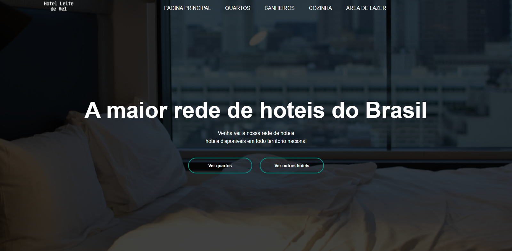

  

<h1 align="center">Hotel leite de mel</h1> 

É um projeto de web site para um hotel ficticio.

Tabela de conteúdos
=================
<!--ts-->
   * [Sobre](#Sobre)
   * [Fotos](#Fotos)
   * [Tabela de Conteudo](#tabela-de-conteudo)
   * [Instalação](#instalacao)
   * [Como usar](#como-usar)
      * [Pre Requisitos](#pre-requisitos)
   * [Tecnologias](#tecnologias)
<!--te-->

<h4 align="center"> 
	🚧  Em desenvolvimento.  🚧
</h4>

## Sobre

 É um projeto para a criação de um web site para um hotel ficticio com o objetivo de treinar o CSS e HTML.

## Fotos

## Tabela de conteudo

- [x] Imagens de hoteis
- [x] CSS

## Como usar

  -

## Pre requisitos

-

## Tecnologias usadas no projeto

 <table>
    <tr>
    <td>HTML</td>
    <td>CSS</td>
    </tr>
    <tr>
    <td>5.*.*</td>
    <td>3.*.*</td>
    </tr>
</table>